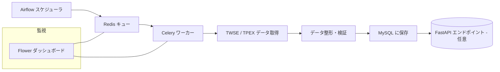

# DataEngineering_TWSE_TPEX
**台灣証券取引所・櫃買中心株価データ自動収集パイプライン**

## 🧩 概要
本プロジェクトは、**台灣証券取引所 (TWSE)** と **櫃買中心 (TPEX)** から
株価データを毎日自動で取得し、整形・検証して **MySQL** に格納する
分散型 ETL データパイプラインです。

**Apache Airflow (CeleryExecutor)** によりスケジューリングを行い、
メッセージブローカーとして **Redis** を使用します。
全てのコンテナは **Docker Swarm** で管理され、
タスク監視には **Flower** を利用します。

## ⚙️ アーキテクチャ


## 🗂 プロジェクト構成
```
DataEngineering_twse_tpex/
├── airflow.yml
├── docker-compose.yml
├── dataflow/
│   ├── crawler/
│   ├── etl/
│   ├── backend/
│   ├── dags/
│   └── schema/
├── Makefile
└── requirements.txt
```

## 🚀 処理の流れ
1️⃣ **Airflow** が定期的に DAG をトリガー
2️⃣ タスクが **Redis キュー** に送信される
3️⃣ **Celery ワーカー** がタスクを実行
4️⃣ **TWSE / TPEX API** から株価データを取得
5️⃣ **pandas / Pydantic** でデータを整形・検証
6️⃣ **MySQL** にアップロード
7️⃣ **Flower** が全体のジョブを監視
8️⃣ （任意）**FastAPI** で外部からデータ参照可能

## 🧠 使用技術
| カテゴリ | ツール |
|-----------|--------|
| オーケストレーション | Apache Airflow (CeleryExecutor) |
| メッセージブローカー | Redis 5.0 |
| データベース | MySQL 8.0 |
| モニタリング | Flower |
| 言語 | Python 3.11 |
| フレームワーク | pandas / SQLAlchemy / Pydantic |
| コンテナ管理 | Docker Swarm |

## 🐳 Swarm デプロイ例
```bash
docker stack deploy -c airflow.yml airflow
docker service ls
docker service ps airflow_webserver
```

## 🪶 アクセス例
| コンポーネント | URL | 説明 |
|----------------|-----|------|
| Airflow UI | http://<host>:8888 | DAG 管理画面 |
| Flower | http://<host>:5555 | タスク監視 |
| MySQL | mysql://<host>:3306 | データ格納先 |

